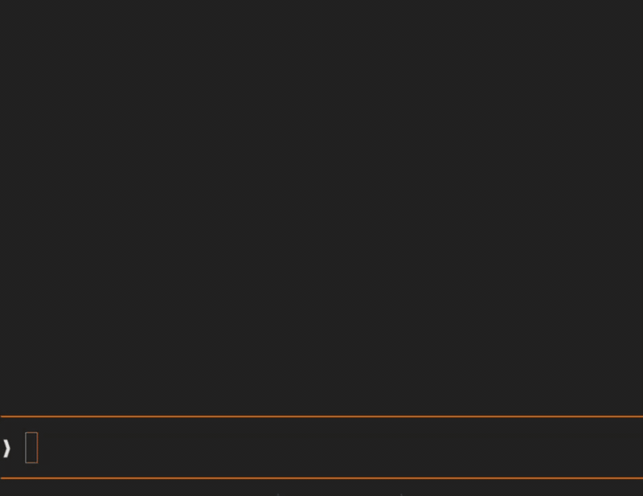

# claude-drop-thumb

ドロップした画像ごとに「#1 ファイル名」のチップをプロンプトの直上に出し、ファイル名・ピクセル寸法・ファイルサイズ・元のパスのカードを開ける Claude Code の mod です。kitty 画像に対応した端末ではサムネイルも出します。
`[Image #1]` の表示だけでは何を貼ったか分からないので、クリックかホバー 1 回でファイルの名前と詳細を確かめられます。

[English](README.md)

*A Claude Code mod that shows a chip (`#1 filename`) above the prompt for each dropped image, with a click/hover card (filename, pixel size, bytes, original path, and a thumbnail on kitty-graphics terminals).*

## 使いどころ

- 1 回のプロンプトに複数の画像を入れて、送る前に `[Image #1]` と `[Image #2]` を見分けたいとき。
- ドロップした画像の寸法・ファイルサイズ・元のパスを、プロンプト欄から離れずに確かめたいとき。
- Ghostty か kitty を使っていて、ドロップした画像のサムネイルをプロンプトの直上で見たいとき。

向かないとき: Linux / Windows で使う場合（本 mod は macOS のツール `sips`・`mdfind`・`cmp` を使います）、または Claude Code が v2.1.287 より古い場合。

## 動くとこう見える

Ghostty では、画像をドロップするとチップが出て、ホバーかクリックでサムネイル付きのカードが開きます:



kitty 画像に対応しない端末では、同じカードがサムネイル抜きで表示されます:

```
#1 201.jpg
╭──────────────────────────────╮
│  (thumbnail)                 │
│  201.jpg                     │
│  500× 500 px · 105 KB        │
│  ~/Downloads/201.jpg         │
╰──────────────────────────────╯
❯ [Image #1]
```

## 導入

マーケットプレイスから入れる場合:

```bash
claude plugin marketplace add i-noma-ru/claude-drop-thumb
claude plugin install drop-thumb@claude-drop-thumb
```

一時的に試す場合:

```bash
claude --plugin-dir /path/to/claude-drop-thumb
```

常時有効にする場合: `~/.claude/settings.json` の `env` に追加します（複数ディレクトリを指定する場合は `:` 区切り）。

```json
{
  "env": {
    "CLAUDE_CODE_PLUGIN_DIRS": "/path/to/claude-drop-thumb"
  }
}
```

次回起動した Claude Code から有効になります。

## 動作要件

- Claude Code v2.1.287 以降（mods 対応。mod は Claude Code のプラグインの一形態で、コマンドや設定では `plugin` と表記されます）
- macOS（`sips`・`mdfind`・`cmp` を使用するため。Linux / Windows は未対応）

## 対応端末

| 端末 | チップ・カード | サムネイル |
| --- | --- | --- |
| Ghostty, kitty | 表示 | 表示 |
| それ以外（Terminal.app, iTerm2, Orca など） | 表示 | 非表示（文字情報のみ） |

サムネイルは Claude Code の `Image` 要素で描画します。Claude Code は端末名が `kitty` または `ghostty` の場合だけ画像を描くため、本 mod もその他の端末では画像を表示しません。
Orca（Electron 製の端末アプリ。xterm.js ベース）は kitty プロトコルの Unicode プレースホルダ方式を解釈しないため、`CLAUDE_CODE_FORCE_TERMINAL_IMAGES=1` で強制表示すると表示が崩れます。この変数は使わないほうがよいです。

## 動作

- 画像をドロップすると、プロンプト直上に `#n ファイル名` のチップが表示されます。
- チップをクリックするとカードが開き、再度クリックすると閉じます。端末からマウス移動イベントを受け取れる環境では、ホバーでも開きます。
- カードの表示項目: サムネイル（kitty 対応端末のみ）・ファイル名・ピクセル寸法（`幅× 高さ px`）・ファイルサイズ（バイト数）・元ファイルのパス（ホームは `~` に縮めます）。
- プロンプトを送信するか、`[Image #n]` の文字を消すと、チップとカードは消えます。

## 対応する画像形式

PNG・JPEG・GIF・WebP・BMP。
Claude Code 本体がプロンプトで「画像」として受け付ける拡張子に準じます（HEIC・TIFF・SVG などは Claude Code 側で `[Image #n]` として認識されません）。GIF は先頭フレームのみがサムネイルとして表示されます。

## 仕組み

1. Claude Code はドロップされた画像を一時フォルダ `<CLAUDE_CODE_TMPDIR または /tmp/claude-<uid>>/<プロジェクト>/<セッション id>/images/<n>.<拡張子>` に保存し、プロンプトには `[Image #n]` の文字だけを置きます。ドロップ操作では編集イベントが発生しないため、本 mod は 200 ms ごとにプロンプト欄をポーリングして `[Image #n]` を検知します。
2. 検知した画像を `sips`（macOS 標準）で 512 px の PNG に縮小し、base64 エンコードして `Image` 要素に渡します。
3. 保存された画像は元ファイルと同一のバイト列であるため、Spotlight（`mdfind`）で同一ファイルサイズの候補を検索し、`cmp` で内容を比較して元のパスを特定します。Spotlight が利用できない環境では、`~/Downloads`、`~/Desktop`、`~/Pictures`、`~/Documents` を `find` で探します。

## 実行するもの・読むもの・書くもの・送るもの

審査のために、このプラグインが実行・参照するものを全部挙げます。マシンの外へは何も出ず、プロンプトの送信や書き換えもしません。

**実行するコマンド（すべて macOS 標準。引数は固定で、渡すのはローカルのパスだけ）:**

- `id -u` — `CLAUDE_CODE_TMPDIR` が無いときだけ。`/tmp/claude-<uid>` のパスを組むため。
- `mkdir -m 700 -p <thumbDir>` と `test -d <thumbDir> -a ! -L <thumbDir>` — 所有者専用のサムネイル置き場を作って確かめる。
- `sips -s format png -Z 512 <画像> --out <サムネイル>` と `sips -g pixelWidth -g pixelHeight <画像>` — 縮小と寸法の取得。
- `mdfind "kMDItemFSSize == <バイト数>"` — 同じサイズのファイルを Spotlight に聞く（3 秒で打ち切り）。
- `find ~/Downloads ~/Desktop ~/Pictures ~/Documents -maxdepth 2 -type f -size <バイト数>c` — Spotlight で見つからないときの予備（3 秒で打ち切り）。
- `cmp -s <一時ファイル> <候補>` — 中身の比較。候補は最大 5 件。

**読むもの:** プロンプト欄の文字（`[Image #n]` を探すため）、Claude Code の一時フォルダにあるドロップ画像、自分が書いたサムネイル、環境変数 `CLAUDE_CODE_TMPDIR`・`HOME`・`TERM_PROGRAM`。`cmp` の段階で、同じサイズの候補ファイル最大 5 件の中身を読みます。

**書くもの:** Claude Code のユーザー固有一時フォルダ内の `drop-thumb/`（`0700`）に置く 512 px の PNG サムネイルだけ。

**送るもの:** ありません。`prompt.submit` をフックするのは送信時に自分のチップを消すためで、モデルの呼び出しもプロンプトの送信・編集もしません。

## プライバシーと安全性

外部へのネットワーク通信は一切行いません。読むのは、Claude Code の一時フォルダにある画像と、サイズが一致した候補ファイルの中身（元ファイルかどうかを比べるため）だけです。書くのは、Claude Code のユーザー固有一時フォルダ（パーミッション `0700` で所有者だけが開ける）の中の `drop-thumb/` に作るサムネイルだけで、共有の `/tmp` 直下には書きません。`claude plugin validate <フォルダ>` を実行すると、フックするイベントと呼び出す API の一覧を確認できます。

## 制限

- クリップボードから直接貼り付けた画像には元ファイルが無いので、チップには `(pasted image)` と出ます。
- サムネイルの行数はセルの縦横比を 0.45 と仮定して算出するため、端末やフォント環境によって上下に余白が生じることがあります。
- 同一サイズのファイルが複数存在する場合は、内容が一致した最初の 1 件を元ファイルと判定します。

## 開発

```bash
claude plugin validate .   # 構成と呼び出し API の検査
claude plugin test .       # hooks/*.test.ts を実行
tsc -p .                   # 一度読み込ませた後に型検査（.claude-plugin/types/ が生成される）
```

## 謝辞

「ドロップは編集イベントを起こさないので、プロンプト欄をポーリングして Claude Code のキャッシュ画像を使う」という手法は [jarrodwatts/claude-image-view](https://github.com/jarrodwatts/claude-image-view)（MIT）を参考にしました。本リポジトリのコードは独自に実装したものであり、同プロジェクトのコードは含みません。

## ライセンス

MIT ライセンス。全文は `LICENSE` を参照してください。
